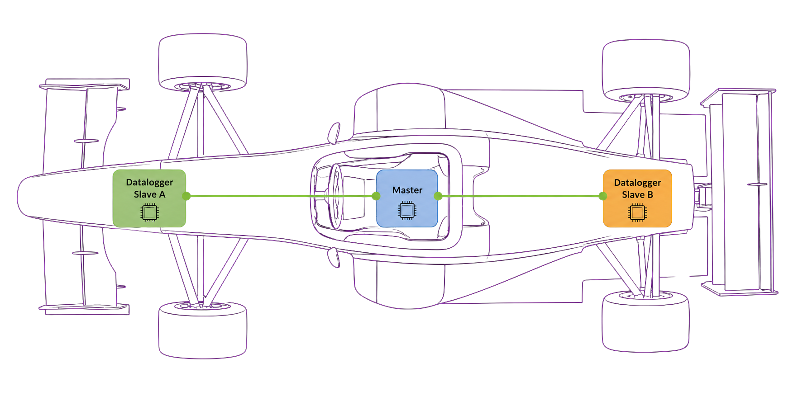
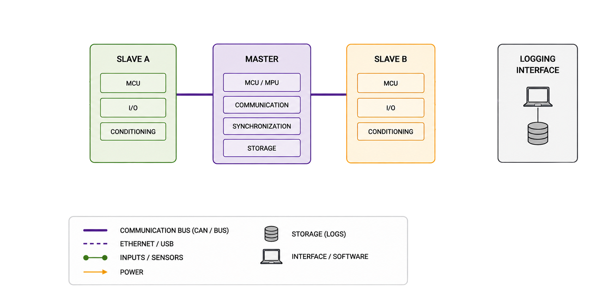
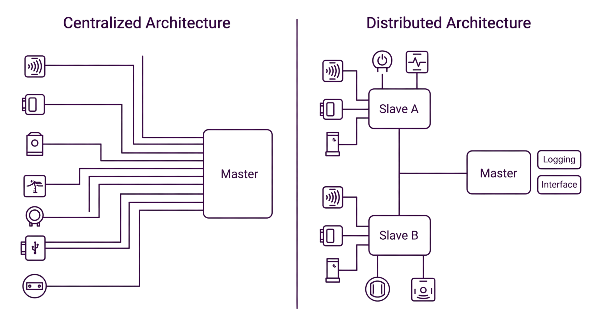

# 🎲 Distributed Data Acquisition Platform for Race Vehicles

> A modular, scalable, engineering-driven architecture for high-performance vehicle instrumentation.


[](LICENSE)

---

## 📖 Overview

This project is the development of a **distributed data acquisition platform** for race vehicles, designed to provide a modular, scalable, and easy-to-maintain architecture — capable of evolving continuously alongside the team's needs.

Built for **Formula SAE** vehicles, the system acquires data from analog, digital, frequency, and CAN sensors, transmits the information over a **CAN** network, and centralizes logging, processing, and telemetry in the Master module.

Unlike traditional systems, which centralize all instrumentation in a single acquisition unit, this platform adopts an architecture composed of one **Master module** and **multiple Slave modules**, distributed throughout the vehicle and placed close to the sensors they monitor.

**Key features:**

- ✅ Distributed acquisition
- ✅ CAN Bus communication
- ✅ Modular hardware
- ✅ Local data logging
- ✅ Telemetry support
- ✅ Fault isolation
- ✅ Expandable architecture

> More than a conventional datalogger, this is an open hardware, firmware, and documentation ecosystem, built to grow alongside the team.



---

## 🎯 The Problem We Solve

Centralized acquisition systems have well-known limitations in race vehicles:

- **Long, complex wiring harnesses**, with dozens of meters of cable running across the vehicle to a single central unit
- **High susceptibility to electromagnetic noise**, since low-amplitude analog signals must travel long distances before being conditioned
- **Difficult maintenance and expansion**, since every new sensor requires running a new cable to the central unit
- **Low scalability**, since expansion capacity is limited by the number of physical inputs on the central unit

Our approach solves these problems by **bringing processing to the sensor**, rather than the other way around.

---

## 🧩 System Architecture

The platform is organized into two core functional blocks:

### 🔹 Master Module

The Master module is the platform's **central management point**. Its responsibilities include:

- Coordinating communication between the modules distributed across the vehicle
- Synchronizing data acquisition across all Slave modules
- Storing the data logged during vehicle operation
- Making data available to external analysis and development tools

The Master's architecture is designed to be **independent of specific implementation technologies** — allowing different software solutions, operating systems, communication protocols, or storage formats to be adopted as the project evolves, without compromising the platform's overall organization.

In the current implementation, the Master runs on an **MPU (processing unit)** using an **RTOS (Real-Time Operating System)** as its software framework, responsible for coordinating logging, processing, and telemetry tasks.

### 🔹 Slave Modules

Slave modules are responsible for **local acquisition** of signals coming from the sensors. Close to the signal source, each module performs:

- Signal conditioning and filtering
- Analog-to-digital conversion
- Initial data processing
- Delivery of processed data to the vehicle's communication network

Each Slave is built around a **dedicated microcontroller (MCU)**, responsible for local acquisition and for communicating over the **CAN** bus, which connects all modules to the Master.

Each module can be **specialized** according to the type of signal it needs to acquire:

| Module Type | Application |
| --- | --- |
| High-precision analog inputs | Pressure, temperature, potentiometer sensors |
| Digital inputs | On/off signals, buttons, limit switches |
| Timer capture | Wheel speed, RPM |
| Inertial sensors (IMU) | Acceleration, gyroscope |
| Suspension position | Vertical travel, suspension stroke |
| Custom modules | Application-specific sensors |

This specialization allows **hardware to be optimized for each module's function**, reducing cost, simplifying the electronic design, and increasing overall system reliability.



### 🔄 Communication Topology (High-Level View)

```text
                              ┌────────────────────────────┐
                              │           Master           │
                              │            MPU             │
                              │     RTOS • Data Logging    │
                              └────────────┬───────────────┘
                                           │
                                       CAN Network
                                           │
                 ┌─────────────────────────┴───────────────────────┐
                 │                                                 │
      ┌──────────▼──────────┐                           ┌──────────▼──────────┐
      │       Slave A       │                           │       Slave B       │
      │         MCU         │                           │         MCU         │
      │ Analog • Digital IO │                           │ Analog • Digital IO │
      └──────────┬──────────┘                           └──────────┬──────────┘
                 │                                                 │
          Vehicle Sensors                                   Vehicle Sensors
```

### 📊 Data Flow

1. Sensors generate raw electrical signals
2. Slave modules acquire and condition these signals locally
3. Measurements are transmitted over the **CAN** bus
4. The Master receives all messages from the network
5. Data is logged and, optionally, transmitted via real-time telemetry

### 🔗 Communication Architecture

Each communication interface is chosen based on bandwidth, latency, reliability, and hardware requirements:

- **CAN Bus** — the system's backbone, connecting the Master to one or more Slave modules
- **I²C / SPI / UART** — local interfaces between each module (Master or Slave) and its directly connected peripherals/sensors

```text
                              ┌─────────────────────────┐
                              │         Master          │
                              │           MPU           │
                              └────────────┬────────────┘
                                           │
                                      CAN Network
                                           │
                 ┌─────────────────────────┴───────────────────────┐
                 │                                                 │
      ┌──────────▼──────────┐                           ┌──────────▼──────────┐
      │       Slave A       │                           │       Slave B       │
      │         MCU         │                           │         MCU         │
      └──────────┬──────────┘                           └──────────┬──────────┘
                 │                                                 │
          I²C • SPI • UART                                  I²C • SPI • UART
                 │                                                 │
          Vehicle Sensors                                   Vehicle Sensors
```

---

## 🔌 Wiring Example

One of the main gains of the distributed architecture is the **drastic reduction in wiring harness complexity**. Instead of long individual cables running from each sensor to a central unit, each Slave module sits close to its own set of sensors, and only a shared communication bus runs across the vehicle.



**Conceptual comparison:**

| Aspect | Centralized System | Distributed System (this project) |
| --- | --- | --- |
| Total cable length | High | Reduced |
| Noise susceptibility | High (long analog signal runs) | Low (signal digitized close to source) |
| Ease of maintenance | Low | High |
| Scalability | Limited | High (just add a new module to the bus) |

---

## ⚙️ Engineering Philosophy

Since its inception, the project has prioritized a **clear separation between hardware, firmware, and development infrastructure**. Each component is developed as an independent module with well-defined interfaces, which ensures:

- ♻️ **Code reuse** across different modules and projects
- 🔧 **Simplified maintenance**, since each part can be modified independently
- 📈 **Easier future expansion**, without needing to restructure the entire platform
- 🔀 **Coexistence of hardware versions**, allowing gradual evolution without breaking compatibility

### 📚 Documented Engineering

More than a source code repository, this project is meant to be a **complete record of the engineering behind its development**. From the earliest stages, we aim to document:

- Architecture decisions and their technical rationale
- Functional diagrams and schematics
- Communication flows between modules
- Hardware version history
- Validation procedures and experimental results

This approach turns the repository into a **technical knowledge base**, valuable both for current developers and for future generations of the team.

---

## 🚀 Why Support This Project

This project goes beyond a one-off telemetry system — it represents an **investment in reusable engineering infrastructure**:

- **Common foundation for multiple applications**: rather than a one-off solution, the platform serves as a foundation for different instrumentation systems, from low-frequency measurements to high-speed signals requiring precise timing
- **Technical development for the team**: development spans embedded hardware, firmware, communication protocols, software engineering, and technical documentation — high-value skills for team members
- **Visibility and branding**: the project's public, well-structured documentation serves as a technical showcase for sponsors and partners
- **Continuity**: the emphasis on documentation and modularity ensures that today's investment keeps generating value across future generations of the system

Companies and sponsors interested in supporting the project can get in touch through the channels listed in the [Contact](#-contact) section.

---

## 🤝 Contributing

Contributions are welcome! To propose improvements, fixes, or new features:

1. Fork this repository
2. Create a branch for your change (`git checkout -b feature/feature-name`)
3. Commit your changes (`git commit -m 'Add new feature'`)
4. Push to the remote repository (`git push origin feature/feature-name`)
5. Open a Pull Request

---

## 📬 Contact

For questions, partnerships, or sponsorship proposals, get in touch with the team:

- **Email:** _luizfernandosilveriofelisbino@gmail.com_

---

## 📄 License

This project is distributed under the **[Apache License 2.0](LICENSE)**.
